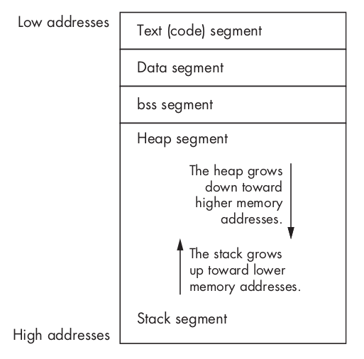

# Hacking: The Art of Exploitation

:::tip About
The goal of this book is to share the art of hacking with everyone

[Hacking: The Art of Exploitation (2008)(2nd)](https://nostarch.com/hacking2.htm)
:::

## Chapter 0x200

### Notes

Hacking is really just the act of finding a clever and counterintuitive solution to a problem

* *Machine language* consists of raw bits and bytes, and it differs from architecture to architecture
* An *assembler* is one form of machine-language translator: it is a program that translates architecture specific *assembly language* into machine-readable code
* A *compiler* converts a high-level language into machine language
* A program written in a high-level language is written once, and the same piece of program code can be compiled into machine language for various specific architectures
* The *GNU Compiler Collection* (GCC) is a free C compiler which outputs executable binary files
* C code is meant to be compiled. The code can't actually do anything until it's compiled into an executable binary file
* `objdump`, included in the GNU development tools, can be used to examine compiled binaries
* Each byte is represented in *hexadecimal notation*, which is a base-16 numbering system. This is a convenient notation since a byte contains 8 bits, each of which can be either true or false. This means a byte has 256 (2^8) possible values, so each byte can be described with 2 hexadecimal digits
* The bits of the machine language instructions must be put somewhere, and this somewhere is called *memory*. Memory is just a
collection of bytes of temporary storage space that are numbered with addresses
* Memory can be thought of as a row of bytes, each with its own memory address. Each byte of memory can be accessed by its address, and in this case the CPU accesses this part of memory to retrieve the machine language instructions that make up the compiled program
* Older Intel x86 processors use a 32-bit addressing scheme, while newer ones use a 64-bit one. The 32-bit processors have 2^32 (or 4,294,967,296) possible addresses, while the 64-bit ones have 2^64 (1.84467441 × 10^19) possible addresses. The 64-bit processors can run in 32-bit compatibility mode
* Assembly language is really just a collection of mnemonics for the corresponding machine language instructions
* Unlike C and other compiled languages, assembly language instructions have a direct one-to-one relationship with their corresponding machine language instructions. This means that since every processor architecture has different machine language instructions, each processor also has a different form of assembly language. Assembly is just a way for programmers to represent the machine language instructions that are given to the processor: there are 2 main types, AT&T syntax and Intel syntax
* These instructions consist of an operation and sometimes additional arguments that describe the destination and/or the source for the operation. These operations move memory around, perform some sort of basic math, or interrupt the processor to get it to do something else. In the end, that’s all a computer processor can really do!
* Processors also have their own set of special variables called *registers*
* The 8086 CPU was the first x86 processor, amd it was developed and manufactured by Intel
* The GNU development tools also include a *debugger* called GDB. Debuggers are used by programmers to step through compiled programs, examine program memory, and view processor registers.
* GDB is used to show the state of the processor registers right before the program starts
* *General-purpose* registers:
    * Accumulator `EAX`
    * Counter `ECX`
    * Data `EDX`
    * Base `EBX`
    * They are used for a variety of purposes, but they mainly act as temporary variables for the CPU when it is executing machine instructions
* *Pointers* registers:
    * Stack Pointer `ESP`
    * Base Pointer `EBP`
    * They are called pointers because they store 32-bit addresses, which essentially point to that location in memory
* *Indexes* registers:
    * Source Index `ESI`
    * Destination Index `EDI`
    * They are also technically pointers, which are commonly used to point to the source and destination when data needs to be read from or written to
* *Instruction Pointer* register `EIP` points to the current instruction the processor is reading during a programs execution by containing its memory address
* *Extended Flags* register `EFLAGS` consists of several bit flags that are used for comparisons and memory segmentations. The actual memory is split into several different segments, and these registers keep track of that
* Assembly instructions in Intel syntax
    * generally follow this style: `operation <destination>, <source>`
    * destination and source values will either be a register, a memory address, or a value
* The instructions before the `main` entrypoint are collectively known as the *function prologue* and are generated by the compiler to set up memory for the rest of the main() function's local variables. Part of the reason variables need to be declared in C is to aid the construction of this section of code. The debugger knows this part of the code is automatically generated and is smart enough to skip over it
* The `x` examine command in GDB can be used to look at a certain address of memory
    * This command expects two arguments when it's used: the location in memory to examine and how to display that memory
    * The display format also uses a single-letter shorthand, which is optionally preceded by a count of how many items to examine
        * `o` Display in octal
        * `x` Display in hexadecimal
        * `u` Display in unsigned, standard base-10 decimal
        * `t` Display in binary
        * `c` Look up a byte on the ASCII table
        * `s` Display in string
    * The default size of a single unit is a four-byte unit called a *word*. The size of the display units for the examine command can be changed by adding a size letter to the end of the format letter
        * `b` A single byte
        * `h` A halfword, which is two bytes in size
        * `w` A word, which is four bytes in size. In this case a double word or *DWORD* refers to a 4-byte value
        * `g` A giant, which is eight bytes in size
    * The examine command also accepts the format letter `i`, short for instruction, to display the memory as disassembled assembly language instructions
* x86 processor values are stored in *little-endian byte order*, which means the least significant byte is stored first. For example, if four bytes are to be interpreted as a single value, the bytes must be used in reverse order
* The `bt` command can be used to *backtrace* the stack
* All numerical values are stored in binary
    - a 32-bit unsigned integer can contain values from 0 (all binary 0s) to (2^32 -1) 4,294,967,295 (all binary 1s)
    - a 32-bit signed integer range from (-2^31) −2,147,483,648 to (2^31 -1) 2,147,483,647. Essentially, one of the bits is a flag marking the value positive or negative
    - positively signed values look the same as unsigned values, but negative numbers are stored differently using a method called *two's complement*
    - the backtrace shows the nested function calls by looking at records kept on the stack. Each time a function is called, a record called a *stack frame* is put on the stack. Each line in the backtrace corresponds to a stack frame. Each stack frame also contains the local variables for that context
* To see the actual data stored in a pointer variable, you can use the unary operator `&` ampersand called *address-of* operator
* To see the data found in the address the pointer is pointing to, instead of the address itself, you can use the unary operator `*` asterisk called *dereference*
* *Typecasting* is simply a way to temporarily change a variable's data type, despite how it was originally defined
* Memory is split into *segments*, and some memory addresses aren't within the boundaries of the memory segments the program is given access to. When the program attempts to access an address that is out of bounds, it will crash and die in what's called a *segmentation fault*
* A compiled program's memory is divided into five segments: text, data, bss, heap, and stack
* The *text segment* is also sometimes called the *code segment* and it's where the assembled machine language instructions of the program are located
    - as a program executes, the EIP is set to the first instruction in the text segment, the processor then follows an execution loop that does the following:
        1. reads the instruction that EIP is pointing to
        2. adds the byte length of the instruction to EIP
        3. executes the instruction that was read in step 1
        4. goes back to step 1
    - sometimes the instruction will be a jump or a call instruction, which changes the EIP to a different address of memory. The processor doesn't care about the change, because it's expecting the execution to be nonlinear anyway
    - write permission is disabled in the text segment, as it is not used to store variables, only code. It can be shared among different copies of the program, allowing multiple executions of the program at the same time without any problems. This memory segment has a fixed size, since nothing ever changes in it
* The data and bss segments are used to store global and static program variables
    - the *data segment* is filled with the initialized global and static variables
    - the *bss segment* is filled with their uninitialized counterparts
    - although these segments are writable, they have a fixed size
* The *heap segment* is a segment of memory a programmer can directly control and use for whatever might need, memory can be reserved and free on the fly
    - the heap segment isn't of fixed size, so it can grow larger or smaller as needed
    - the growth of the heap moves downward toward higher memory addresses
    - the heap will grow and shrink depending on how much memory is reserved for use
    - all of the memory within the heap is managed by allocator and deallocator algorithms, which respectively reserve a region of memory in the heap for use and remove reservations to allow that portion of memory to be reused for later reservations
* The *stack segment* also has variable size and is used as a temporary scratch pad to store local function variables and context during function calls
    - this is what GDB's backtrace `bt` command looks at
    - when a program calls a function, that function will have its own set of passed variables, and the function's code will be at a different memory location in the text (or code) segment. Since the context and the EIP must change when a function is called, the stack is used to remember all of the passed variables, the location the EIP should return to after the function is finished, and all the local variables used by that function. All of this information is stored together on the stack in what is collectively called a *stack frame*. The stack contains many stack frames
    - a stack is an abstract data structure, it has first-in, last-out (FILO) ordering, which means the first item that is put into a stack is the last item to come out of it
    - when an item is placed into a stack, it's known as *pushing*, and when an item is removed from a stack, it's called *popping*
    - the stack segment of memory is, in fact, a stack data structure, which contains stack frames
    - the `ESP` register is used to keep track of the address of the end of the stack, which is constantly changing as items are pushed into and popped off of it
    - the stack is also not of a fixed size. Opposite to the dynamic growth of the heap, as the stack changes in size, it grows upward in a visual listing of memory, toward lower memory addresses
    - the FILO nature of a stack might seem odd, but since the stack is used to store context, it's very useful
    - when a function is called, several things are pushed to the stack together in a stack frame
        * the `EBP` register, sometimes called the *frame pointer* (FP) or *local base* (LB) pointer, is used to reference local function variables in the current stack frame
        * each stack frame contains the parameters to the function, its local variables, and two pointers that are necessary to put things back the way they were: the *saved frame pointer* (SFP) and the *return address*
        * the SFP is used to restore EBP to its previous value, and the return address is used to restore EIP to the next instruction found after the function call. This restores the functional context of the previous stack frame
* The first few instructions of each function set up the stack frame. These instructions are collectively called the *procedure prologue* or *function prologue*. They save the frame pointer on the stack, and they save stack memory for the local function variables. Sometimes the function prologue will handle some stack alignment as well. The exact prologue instructions will vary greatly depending on the compiler and compiler options, but in general these instructions build the stack frame

```bash
# x86 (32 bits) + remove ASLR warning
docker run --rm -it \
  --name ubuntu \
  --cap-add=SYS_PTRACE \
  --security-opt seccomp=unconfined \
  -v "$(pwd)/notes/hacking-the-art-of-exploitation:/share" \
  --platform linux/386 \
  i386/ubuntu:18.04 \
  bash
# install C compiler and debugger
apt-get update && apt-get install gcc gdb -y

cd /share/chapter02
gcc firstprog.c
# default binary file name
./a.out

objdump -D a.out | grep -A20 main
objdump -D a.out -M intel | grep -A20 main
# <ADDRESS> <MACHINE_LANGUAGE_INSTRUCTION> <ASSEMBLY_LANGUAGE_INSTRUCTION>
```

Little-endian explained

```bash
gdb -q ./a.out 
(gdb) break main
(gdb) run
#...
(gdb) x/4xb $eip
0x5655e53a <main+29>:   0xc7    0x45    0xf4    0x00
(gdb) x/4ub $eip
0x5655e53a <main+29>:   199     69      244     0
(gdb) x/1xw $eip
0x5655e53a <main+29>:   0x00f445c7
(gdb) x/1uw $eip
0x5655e53a <main+29>:   16008647

bc -ql
199*(256^3)+69*(256^2)+244*(256^1)+0*(256^0)
3343250432
0*(256^3)+244*(256^2)+69*(256^1)+199*(256^0)
16008647

# the seven bytes EIP is pointing to actually are machine language
# for the corresponding assembly instruction
objdump -D a.out -M intel | grep -A20 main
#...
 53a:	c7 45 f4 00 00 00 00 	mov    DWORD PTR [ebp-0xc],0x0
```

Remove modern protections
```bash
# includes symbols: -g
# to build 32-bit code on a 64-bit machine: -m32
# disable canary: -fno-stack-protector
# disable DEP: -z execstack
# to have the compiler generate asm that doesn't bother with PIE stuff: -fno-pie
# disable PIE to have it not link that machine code into a PIE: -no-pie
gcc -g -m32 -fno-stack-protector -z execstack -fno-pie -no-pie firstprog.c -o firstprog.out

# disable ASLR in host (outside docker)
sysctl -n kernel.randomize_va_space
sysctl -w kernel.randomize_va_space=0

# debugger
gdb -q ./firstprog.out
#(gdb) set disassembly intel
#(gdb) list
#(gdb) disassemble main
#(gdb) break main
#(gdb) run
#(gdb) info registers
#(gdb) info registers eip
#(gdb) i r eip
#(gdb) x/o 0x565dc53a
#(gdb) x/x $eip   
#(gdb) x/u $eip
#(gdb) x/t $eip
#(gdb) x/10x $eip
#(gdb) x/8xb $eip
#(gdb) x/8xh $eip
#(gdb) x/8xw $eip
#(gdb) x/i $eip
#(gdb) x/3i $eip
#(gdb) print $ebp - 4
#(gdb) x/6cb <ADDRESS>
#(gdb) x/s <ADDRESS>
#(gdb) print &pointer
#(gdb) print *pointer
#(gdb) nexti
#(gdb) where
#(gdb) quit

# use it as hexadecimal calculator
gdb -q --batch -ex "p 0xbb - 0xaa"

# default config
echo "set disassembly intel" > ~/.gdbinit

# ASCII table
man ascii
```

Analysis
```
                       ┌────────────────┐
                       │ 440            ◄──┐
┌────────────────┐     │ 448 PUTS       │  │
│ 437 SET 0      │     │ 450 INC 1      │  │
│ 43e JMP to 454 ├─────► 454 CMP == 9   │  │
└────────────────┘     │ 458 JLE 440    ├──┘
                       └───────┬────────┘
                               │
                            ┌──▼──┐
                            │ 45a │
                            └─────┘

Dump of assembler code for function main:
   0x08048426 <+0>:		lea    ecx,[esp+0x4]
   0x0804842a <+4>:		and    esp,0xfffffff0
   0x0804842d <+7>:		push   DWORD PTR [ecx-0x4]
   0x08048430 <+10>:	push   ebp
   0x08048431 <+11>:	mov    ebp,esp
   0x08048433 <+13>:	push   ecx
   0x08048434 <+14>:	sub    esp,0x14

   # MAIN
   0x08048437 <+17>:	mov    DWORD PTR [ebp-0xc],0x0      ; 437 SET 0
   0x0804843e <+24>:	jmp    0x8048454 <main+46>          ; 43e JMP to 454 (#1)

   # LOOP
   0x08048440 <+26>:	sub    esp,0xc                      ; 440 (#2)
   0x08048443 <+29>:	push   0x80484f0
   0x08048448 <+34>:	call   0x80482e0 <puts@plt>         ; 448 PUTS
   0x0804844d <+39>:	add    esp,0x10
   0x08048450 <+42>:	add    DWORD PTR [ebp-0xc],0x1      ; 450 INC 1
   0x08048454 <+46>:	cmp    DWORD PTR [ebp-0xc],0x9      ; 454 CMP == 9 (#1)
   0x08048458 <+50>:	jle    0x8048440 <main+26>          ; 458 JLE to 440 (#2)

   # EXIT
   0x0804845a <+52>:	mov    eax,0x0
   0x0804845f <+57>:	mov    ecx,DWORD PTR [ebp-0x4]
   0x08048462 <+60>:	leave  
   0x08048463 <+61>:	lea    esp,[ecx-0x4]
   0x08048466 <+64>:	ret    
End of assembler dump.
```

Other examples
```bash
# char_array
# datatype_sizes
# pointer
# addressof
# fmt_strings
# input
# typecasting
# pointer_types
# commandline
# convert
# scope
# static
# stack_example
# memory_segments
# heap_example
# errorchecked_heap
# simplenote
# bitwise
# fcntl_flags
# uid_demo
# notetaker
# notesearch
# time_example
# funcptr_example
# rand_example
# game_of_chance (from sources)
gcc -g -m32 -fno-stack-protector -z execstack -fno-pie -no-pie <PROGRAM>.c -o <PROGRAM>.out

gdb -q ./<PROGRAM>.out
```



### Resources

* [pcalc](https://github.com/vapier/pcalc)

```bash
git clone https://github.com/vapier/pcalc.git
cd pcalc/
apt install make bison flex
make
make install
pcalc
```

### Extra

* [Security Protection Mechanism](https://tyeyeah.github.io/2020/01/23/2020-01-23-Security-Protection-Mechanism)
* [Stack Canaries](https://www.sans.org/blog/stack-canaries-gingerly-sidestepping-the-cage) to prevent `stack smashing detected`
* [How to turn off gcc compiler optimization to enable buffer overflow](https://stackoverflow.com/a/40867982)
* [What is the -fPIE option for position-independent executables in gcc?](https://stackoverflow.com/questions/2463150/what-is-the-fpie-option-for-position-independent-executables-in-gcc-and-ld) about `PIE` and `ASLR`
* [Error disabling address space randomization: Operation not permitted](https://stackoverflow.com/questions/35860527/warning-error-disabling-address-space-randomization-operation-not-permitted)
* [set disable-randomization command](https://visualgdb.com/gdbreference/commands/set_disable-randomization)
* [Two's Complement](https://www.cs.cornell.edu/~tomf/notes/cps104/twoscomp.html)

## Chapter 0x300

### Notes

* Exploiting a program is simply a clever way of getting the computer to do what you want it to do, even if the currently running program was designed to prevent that action. A program can only do what it's programmed to do, to the letter of the law. Unfortunately, what's written doesn't always coincide with what the programmer intended the program to do.
* Off-by-one errors and improper Unicode expansion are all mistakes that can be hard to see at the time but are glaringly obvious to any programmer in
hindsight
* *Buffer Overrun* or *Buffer Overflow*

```bash
cd /share/chapter03

# overflow_example
# exploit_notesearch
# auth_overflow
# getenv_example
# getenvaddr
# fmt_uncommon
# fmt_vuln
# dtors_sample

# exploit_notetaker.txt
# exploit_game_of_chance.txt
# exploit_global_offset_table.txt
```

Generate payloads
```bash
# perl
perl -e 'print "A" x 27;'
perl -e 'print "\x41" x 20;'
perl -e 'print "A"x20 . "BCD" . "\x61\x66\x67\x69"x2 . "Z";'
# little endian: de|ad|be|ef
perl -e 'print "A"x16 . "\xef\xbe\xad\xde"'
$(perl -e 'print "uname";')
una$(perl -e 'print "m";')e
u`perl -e 'print "na";'`me
u$(perl -e 'print "na";')me
perl -e 'print crypt("password", "salt"). "\n"'

# python
python -c 'print "A"*27'
python -c 'import sys; sys.stdout.write("A"*27 + "\x90"*4)'

for i in {1..5}; do echo "hello"; done
for i in $(seq 0 30 300); do echo "hello-$i"; done
```

Others

```bash
# list symbols
nm <BINARY>
```

### Extra

* [gdbgui](https://www.gdbgui.com)

## Chapter 0x400

### Notes

* The seven OSI layers are as follows:
    - The **Physical layer** deals with the physical connection between two points. This is the lowest layer, whose primary role is communicating raw bit streams. This layer is also responsible for activating, maintaining, and deactivating these bit-stream communications *e.g. Ethernet Cable and Card*
    - The **Data-link layer** deals with actually transferring data between two points. In contrast with the physical layer, which takes care of sending the raw bits, this layer provides high-level functions, such as error correction and flow control. This layer also provides procedures for activating, maintaining, and deactivating data-link connections *e.g. Ethernet*
        * Every Ethernet device is assigned a globally unique address consisting of six bytes, usually written in hexadecimal in the form `xx:xx:xx:xx:xx:xx`, known as Media Access Control (MAC) addresses
        * An Ethernet header is 14 bytes in size and contains the source and destination MAC addresses for this Ethernet packet
        * Ethernet addressing also provides a special broadcast address, consisting of all binary 1's `ff:ff:ff:ff:ff:ff`
        * The MAC address of a network device isn't meant to change, but its IP address may change regularly. The concept of IP addresses doesn't exist at this level, only hardware addresses do. To correlate the two addressing schemes, the Address Resolution Protocol (ARP) is used. There are four different types of ARP messages, but the two most important types are *ARP request messages* and *ARP reply messages*
    - The **Network layer** works as a middle ground; its primary role is to pass information between the lower and the higher layers. It provides addressing and routing *e.g. IP address and router*
    - The **Transport layer** provides transparent transfer of data between systems. By providing reliable data communication, this layer allows the higher layers to never worry about reliability or cost-effectiveness of data transmission e.g. *TCP*
    - The **Session layer** is responsible for establishing and maintaining connections between network applications
    - The **Presentation layer** is responsible for presenting the data to applications in a syntax or language they understand. This allows for things like encryption and data compression
    - The **Application layer** is concerned with keeping track of the requirements of the application *e.g. HTTP, SMTP, IMAP, FTP*
* When data is communicated through these protocol layers, it's sent in small pieces called packets. Each packet contains implementations of these protocol layers and wraps the previous layer. This process is called encapsulation. Each wrapped layer contains a header and a body. The header contains the protocol information needed for that layer, while the body contains the data for that layer. The body of one layer contains the entire package of previously
encapsulated layers.
* A socket is a standard way to perform network communication through the OS. A socket can be thought of as an endpoint to a connection, but they are just a programmer's abstraction that takes care of all the nitty-gritty details of the OSI model. To the programmer, a socket can be used to send or receive data over a network at the session layer. The most common types are stream sockets (Transmission Control Protocol) and datagram sockets (User Datagram Protocol)
* In C, sockets behave a lot like files since they use file descriptors to identify themselves. The port number and IP address used in the AF_INET socket address structure are expected to follow the network byte ordering, which is big-endian. This is the opposite of x86's little-endian byte ordering

```bash
cd /share/chapter04

# simple_server
# host_lookup
# webserver_id
# tinyweb
# raw_tcpsniff
# pcap_sniff
# decode_sniff
# synflood
# rst_hijack
```

Sources
```bash
/usr/include/i386-linux-gnu/sys/socket.h
/usr/include/i386-linux-gnu/bits/socket.h
/usr/include/i386-linux-gnu/bits/socket_type.h
/usr/include/netinet/in.h
/usr/include/arpa/inet.h
/usr/include/netdb.h
/usr/include/linux/if_ether.h
/usr/include/netinet/ip.h
/usr/include/netinet/tcp.h
```

Network Sniffing

* On an *unswitched network*, Ethernet packets pass through every device on the network, expecting each system device to only look at the packets sent to its destination address
* If a device is set to *promiscuous mode*, it looks at all packets, regardless of the destination address
* In a *switched network* environment, packets are only sent to the port they are destined for, according to their destination MAC addresses, so promiscuous devices aren't able to sniff any additional packets
* The act of forging a source address in a packet is known as *spoofing*
* ARP cache poisoning
    - when an ARP reply comes in with an IP address that already exists in the ARP cache, the receiving system will overwrite the prior MAC address information with the new information found in the reply
    - no state information about the ARP traffic is kept: systems will accept an ARP reply even if they didn't send out an ARP request
    - the attacker sends spoofed ARP replies to certain devices that cause the ARP cache entries to be overwritten with the attacker's data
    - due to timeout values, the victim machines will periodically send out real ARP requests and receive real ARP replies in response. In order to maintain the redirection attack, the attacker must keep the victim machine's ARP caches poisoned
* A *gateway* is a system that routes all the traffic from a local network out to the Internet

```bash
# enable promiscuous mode
sudo ifconfig eth0 promisc

sudo tcpdump -l -X 'ip host <IP_ADDRESS>'
```

Denial of Service (most of the attacks are obsolete)

* A DoS attack simply prevents access to a service or resource. There are two general forms of attacks: those that crash services and those that flood services
* A *SYN flood* tries to exhaust states in the TCP/IP stack: the kernel has a finite table that can only track so many incoming connections
    - a technique called syncookies to try to prevent SYN flood attack: the TCP connections don't actually become active until the final ACK packet for the TCP handshake is checked
* The *Ping of Death*: ICMP echo messages can only have 2^16, or 65.536, bytes of data in the data part of the packet. Several operating systems crashed if they were sent ICMP echo messages that exceeded the size specified. See also *Bluesmack* for Bluetooth
* *Teardrop* exploited IP fragmentation reassembly
* *Ping/UDP Flooding* also 
    - an attacker with greater bandwidth than a victim can send more data than the victim can receive and therefore deny other legitimate traffic from getting to the victim
    - an *amplification attack* uses spoofing and broadcast addressing to amplify a single stream of packets by a hundred-fold: also known as *smurf* and *fraggle* attacks
* In a DDoS attack, the attacker first compromises a number of other hosts and installs daemons on them. Systems installed with such software are commonly referred to as bots and make up what is known as a botnet

TCP/IP hijacking
* TCP/IP hijacking is a clever technique that uses spoofed packets to take over a connection between a victim and a host machine
* RST Hijacking involves injecting an authentic-looking reset (RST) packet. If the source is spoofed and the acknowledgment number is correct, the receiving side will believe that the source actually sent the reset packet, and the connection will be reset
    - libpcap provides a way to tell the kernel to only send certain packets that match a filter. This filter, known as a Berkeley Packet Filter (BPF), is very similar to a program

Port Scanning
* Port scanning is a way of figuring out which ports are listening and accepting connections
    - the simplest form of port scanning involves trying to open TCP connections to every possible port on the target system: it's noisy and detectable
* A *SYN scan* `nmap -sS` is also sometimes called a half-open scan
    - The TCP/IP handshake: when a full connection is made, first a SYN packet is sent, then a SYN/ACK packet is sent back, and finally an ACK packet is returned to complete the handshake and open the connection
    - A SYN scan doesn't complete the handshake, so a full connection is never opened
    - If a SYN/ACK packet is received in response, that port must be accepting connections. This is recorded, and an RST packet is sent to tear down the connection
* *FIN* `nmap -sF`, *X-mas* `nmap -sX`, and *Null scans* `nmap -sN` techniques involve sending a nonsensical packet to every port on the target system: if a port is listening, these packets just get ignored. However, if the port is closed and the implementation follows protocol (RFC 793), an RST packet will be sent. This difference can be used to detect which ports are accepting connections, without actually opening any connections
    - FIN scan sends a FIN packet
    - X-mas scan sends a packet with FIN, URG, and PUSH turned on
    - Null scan sends a packet with no TCP flags set
    - they are stealthier, but they can also be unreliable: Microsoft's implementation of TCP doesn't send RST packets
* *Spoofing Decoys* `nmap -D` to avoid detection. This technique simply spoofs connections from various decoy real IP addresses of live hosts in between each real port-scanning connection
* *Idle scanning* `nmap -sI` is a way to scan a target using spoofed packets from an idle host, by observing changes in the idle host that is not sending or receiving any other network traffic and that has a TCP implementation that produces predictable IP IDs that change by a known increment with each packet. IP IDs are meant to be unique per packet per session

### Resources

* [RFC 826](https://datatracker.ietf.org/doc/html/rfc826): Address Resolution Protocol
* [RFC 791](https://datatracker.ietf.org/doc/html/rfc791): Internet Protocol
* [RFC 793](https://datatracker.ietf.org/doc/html/rfc793): Transmission Control Protocol
* [RFC 768](https://datatracker.ietf.org/doc/html/rfc768): User Datagram Protocol

### Extra

* [Hex Packet Decoder](https://hpd.gasmi.net)
* [Wireshark](https://www.wireshark.org)
* [Kismet](https://www.kismetwireless.net)
* [Ettercap](https://www.ettercap-project.org)
* [Scapy](https://scapy.net)
* [The Art of Packet Crafting with Scapy](https://0xbharath.github.io/art-of-packet-crafting-with-scapy)
* [tcpdump](https://www.tcpdump.org)
* [dsniff](https://www.monkey.org/~dugsong/dsniff)
* [Using libpcap in C](https://www.devdungeon.com/content/using-libpcap-c)
* [nemesis](https://github.com/libnet/nemesis)
* [nmap](https://github.com/nmap/nmap)

## Chapter 0x500

TODO review
* `exploit_notesearch` implementation pag 136-150
* `tinyweb_exploit` implementation pag 272-280

```bash
cd /share/chapter05

# helloworld
```

Install man pages

```bash
apt install man-db
# extra
apt-cache search manpages | egrep 'manpages-(dev|posix)'

# fix "See 'man 7 undocumented'"
yes | unminimize
```

* Every possible Linux system call is enumerated, so they can be referenced by numbers when making the calls in assembly, See `/usr/include/???/unistd.h`
* The `mov` instruction copies a value between its two operands. Using Intel assembly syntax, the first operand is the destination and the second is the source
* The `int` instruction sends an interrupt signal to the kernel, defined by its single operand. With the Linux kernel, interrupt `0x80` is used to tell the kernel to make a system call. When the `int 0x80` instruction is executed, the kernel will make a system call based on the first four registers. The `EAX` register is used to specify which system call to make, while the `EBX`, `ECX`, and `EDX` registers are used to hold the first, second, and third arguments to the system call. All of these registers can be set using the mov instruction
* To create an executable *ELF* binary, the assembly code must first be assembled and then linked into an executable format
* The `nasm` assembler with the `-f elf` argument will assemble the `*.asm` into an object file ready to be linked as an ELF binary
* The linker program `ld` will produce an executable `*.out` binary from the assembled object
* In shellcode
    - instructions must be self-contained and ready to take over control of the processor regardless of its current state
    - the bytes for a string must be mixed together with the bytes for the assembly instructions, since there aren't definable or predictable memory segments
    - to access the string as data we need a pointer to it. When the shellcode gets executed, it could be anywhere in memory. The string's absolute memory address needs to be calculated relative to EIP
* Stack-based exploits are made possible by the `call` and `ret` instructions. When a function is called, the return address of the next instruction is pushed to the stack, beginning the stack frame. After the function is finished, the ret instruction pops the return address from the stack and jumps EIP back there. By overwriting the stored return address on the stack before the ret instruction, we can take control of a program's execution
* The `nasm` assembler converts assembly language into machine code and a corresponding tool called `ndisasm` converts machine code into assembly

```bash
apt install nasm -y
# install hexdump
apt install bsdmainutils -y

# assemble (elf|elf64)
nasm -f elf helloworld.asm
# link
ld -m elf_i386 helloworld.o -o helloworld.out
# run
./helloworld.out

# hexadecimal view
hexdump -C helloworld_nosegment.out
# disassemble
ndisasm -b32 helloworld_nosegment.out

objdump -D -M intel helloworld.out
readelf -a helloworld.out
strings helloworld.out

# helloworld
# helloworld_nosegment
# helloworld_nonull

# exploit_helloworld.txt
```

### Extra

* [NASM](https://www.nasm.us)
* [The Linux Kernel Archives](https://www.kernel.org)
* [The Linux Kernel Labs](https://linux-kernel-labs.github.io)
* [Linux System Call Table for x86/64](https://blog.rchapman.org/posts/Linux_System_Call_Table_for_x86_64)
* [What are the return values of system calls in Assembly?](https://stackoverflow.com/questions/38751614/what-are-the-return-values-of-system-calls-in-assembly)
* ITSC 3181 - Lecture 2 [Compilation, Assembling, Linking and Program Execution](https://passlab.github.io/ITSC3181/notes/lecture02_CompilationAssemblingLinkingProgramExecution.pdf)
* [Linux Shellcode 101: From Hell to Shell](https://axcheron.github.io/linux-shellcode-101-from-hell-to-shell)

> TODO pag 295
